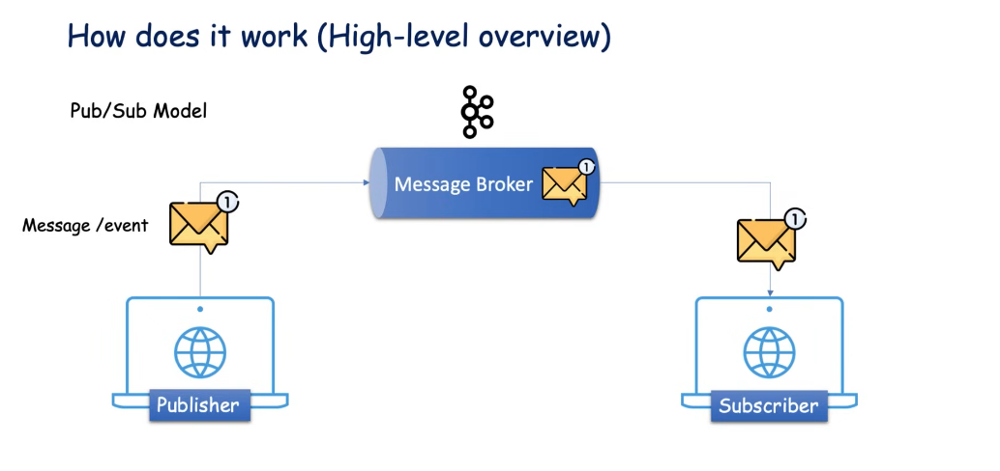

# Ghi chú cho bản thân

## Agenda

### What is Kafka?

Apache Kafka là một nền tảng **phân phối luồng sự kiện** mã nguồn mở (_open source **distributed event streaming** platform_)

- Khi nói về **event streaming**, thì bao gồm hai công việc:

  - Tạo real-time event stream.
  - Xử lí real-time event stream.

  Để hiểu rõ hơn, ta lấy ví dụ sau: _Ứng dụng đặt mua vé máy bay sử dụng API để xử lí transaction giao dịch là PayTM._
  <br>

  > Mỗi transaction giao dịch sẽ tạo ra một **event** rồi gửi đến Kafka server.
  >
  > - Trên ứng dụng thực tế, các transaction giao dịch có thể diễn ra đồng thời với số lượng rất lớn trong vài giây, việc này tạo ra một loạt các event gửi đến Kafka, quá trình này gọi là **Create / Generate realtime event stream of data**.
  >   Khi Kafka server nhận được data, nó cần phải xử lí.
  > - Giả sử ứng dụng có một _client application_ có vai trò là đọc data từ Kafka và xử lí yêu cầu đặt vé máy bay và client application muốn hạn chế mỗi user chỉ được phép thực hiện 10 transaction mỗi ngày. Nếu vượt mức transaction, application sẽ **send một mail thông báo** đến email của user.
  > - Trong trường hợp như trên, client application phải **liên tục** thực hiện **validation kiểm tra số lượng transaction của mỗi user**. Nghĩa là application phải **liên tục lắng nghe** Kafka Server để nhận message. Quá trình này được gọi là **Processing realtime event stream of data**.

- Khi nói về **distributed**, thì trong **Microservices**, định nghĩa distributed nghĩa là phân tán nhiều máy chủ đến nhiều node khác nhau hay nhiều region khác nhau để cân bằng tải và tránh down time:
  > - Kafka là distributed platform, nghĩa là ta cũng có thể phân tán Kafka server chạy ở nhiều region khác nhau.
  > - Trong trường hợp có một server nào đó bị sập, server khác sẽ thay thế nhận lấy traffic để tránh trường hợp cả hệ thống bị sập.

### Why do we need Kafka?

#### Ví dụ đơn giản:

Service **A** có một message quan trọng cần phải nhận vì message này liên quan đến logic của toàn hệ thống hay liên quan đến giao dịch tiền. Thế nhưng trong lúc message gửi đến thì **A** đang bị sập và không thể nhận được, dẫn đến mất mát dữ liệu trong hệ thống hay tệ hơn là sai logic của toàn bộ hệ thống.

Trong trường hợp này, Kafka đóng vai trò như là một **hòm đưa thư**, khi message đến service, message sẽ được đặt vào hòm thư này và khi hệ thống hoạt động trở lại, chỉ việc lấy tất cả message từ hòm thư và xử lí đồng loạt.

#### Ví dụ phức tạp hơn

Giả sử chúng ta có 4 service cần giao tiếp và kết nối với 5 service/server khác nhau


Trong trường hợp này, việc quản lí kết nối giữa các service sẽ là một bài toán khó khăn bởi vì chúng ta cần phải quan tâm đến các yếu tố sau đây đối với mỗi service:

1. Data Format
2. Connection Type
3. Số lượng Connection

##### 1. Data Format

Mỗi service có thể muốn cung cấp hoặc nhận một loại data theo format khác nhau. Rất khó khăn để handle data format và schema cho mỗi service trong trường hợp này.

##### 2. Connection Type

Có thể có nhiều loại kết nối (HTTP, TCP, JDBC, ...), với nhiều loại connect này sẽ rất khó để maintain giữa các service.

##### 3. Số lượng Connection

Nếu chúng ta nhìn nhận kĩ càng sẽ dễ dàng nhận thấy mỗi service ở sơ đồ trên hiện tại đang duy trì 5 connection đến các server đích. Tổng cộng là **20 connection**.


Với nhiều kết nối và phân tán ra như vậy, việc quản lý rất khó khăn. Kafka sẽ giải quyết vấn đề bằng cách tập trung chúng lại một chỗ như sau:


Xem xét sơ đồ:

- Mỗi service giờ đây sẽ không quan tâm đến data format, chúng chỉ đơn giản là gửi dữ liệu tập trung đến Kafka server.
- Server đích cần loại data nào, sẽ chủ động lấy từ Kafka ra.
- Số lượng connection giảm đi, giờ đây chỉ còn **9 connection**.

### How does Kafka work (high level overview)

### Khái quát đơn gản về mô hình Pub/Sub

Bao gồm 3 phần:

1. Publisher
2. Subsciber
3. Message Broker

- **Publisher** là bên sẽ "phát hành" event hoặc message đến hệ thống Kafka.
- Message sẽ đc gửi đi rồi lưu trữ tại **Message Broker** hay nói cách khác là **Kafka Server**.
- **Subsribers** sẽ đi đến các **Message Broker** cụ thể và yêu cầu Message, hoặc các Subsribers cơ bản sẽ **lắng nghe** các broker để lấy message.



## Kafka Architecture & Components

### Cluster

Cluster là một khái niệm quen thuộc trong thế giới Microservice, chúng là một cụm các máy chủ. Trong định nghĩa của Kafka cũng tương tự.
Bởi vì Kafka cũng là hệ thống phân tán, nó có thể có nhiều **Kafka server** hay **Broker** trong một **Kafka Cluster**

> - Có thể có một hoặc nhiều broker trong một Kafka cluster.
> - Cluster giúp đảm bảo khả năng chịu lỗi, khả năng mở rộng và hiệu suất cao trong việc xử lý một lượng lớn dữ liệu event.


### Topic

Topic định nghĩa danh mục cho các message hoặc dán nhãn cho các message và từ đó, Consumer có thể nhận được các message liên quan đến Topic mà mình đã đăng ký lắng nghe.

Xem xét lại ví dụ PayTM trước đó:


- **Consumer** - _client application_ yêu cầu Kafka gửi tất cả message (các transaction) cho mình.
- **Broker** - _Kafka_ gửi toàn bộ message bên trong đến cho application, dẫn đến có nhiều message không liên quan.


- **Consumer** - _client application_ thay vào đó, yêu cầu gửi tất cả message payment liên quan cho mình.
- **Broker** - _Kafka_ lại tiếp tục confuse vì có nhiều loại message bên trong nó, và không biết làm sao để lọc ra các message liên quan đến payment.

=> lúc này chúng ta cần đến **Topic**.


- Với **Topic**, Broker có thể phân nhóm các message theo từng Topic khác nhau, và **Consumer** giờ đây chỉ cần lắng nghe một Topic cụ thể để nhận message liên quan
- Chúng ta có thể xem Topic giống như là các bảng trong database của Kafka Server, với mỗi message, Kafka sẽ kiểm tra xem nên thêm message đó vào bảng nào trong database.


### Partitions

Chúng ta đã biết PayTM sẽ sản sinh ra rất nhiều message đến Broker và Broker có thể lưu các message nào theo từng Topic.

Giả sử lúc này đây, chúng ta có số lượng **cực lớn** các message, lên đến hàng triệu. Lúc này đây topic là không đủ để handle các message.

Việc lưu các message trở nên bất khả thi trên một máy chủ. Do kafka là một hệ thốntg máy chủ phân tán, thế nên chúng ta có thể **chia nhỏ** các Topic thành nhiều phần, và phân tán mỗi phần sang một máy chủ khác.

Các phần topic được gọi là các **Partitions**


Với việc có nhiều Partiton cho mỗi Topic, mỗi khi publisher gửi một lượng lớn message cho một topic nhất định, thì mỗi Partition trong topic chỉ việc lưu một phần message, giúp cải thiện đáng kể hiệu năng.

Và kể cả khi có một partition bị down, miễn là các partition khác còn hoạt động thì cả kênh giao tiếp sẽ không bị gián đoạn.

### Offset

Đến giờ chúng ta đã nắm được:

- Mỗi kafka cluster sẽ có nhiều kafka server.
- Mỗi kafka server sẽ có nhiều kafka topic.
- Mỗi Kafka topic sẽ có nhiều partions.

Mỗi khi producer gửi message đến, message này sẽ nằm bên trong **bất kì partition nào** của một topic nhất định.

Chúng ta sẽ không kiểm soát quá trình này, quá trình này hoạt động dựa trên quy tắc xoay vòng. Mỗi khi một message được đặt vào một partion, nó sẽ được gắn một số để định danh vị trí được gọi là **offset**. Các số này là một dãy liên tục tăng.

Vai trò của **offset** là sẽ giúp chúng ta biết được **message nào đã được consume** bởi consumer.


Lấy ví dụ:

> - Giả sử trong quá trình hoạt động, Consumer đã consume được đến message có offset 3 thì bỗng dưng Consumer vì lí do gì đó lại offline.
> - Trong quá trình offline, có thêm 2 message offset 4 và 5 được gửi đến.
>   
> - Khi consumer online trở lại, số offset 3 sẽ giúp Broker biết được nên gửi tiếp message offset 4 và 5 cho consumer.
>   

### Consumer Groups

Đến hiện tại chúng ta đã rõ các khái niệm này:

1. Producer sẽ push một lượng lớn các message vào một **Topic**.
2. Các Message lại được chia nhỏ vào nhiều **Partition** khác nhau của một **Topic**.
3. Bên trong mỗi **Partiton**, các message sẽ có được đánh dấu một số **Offset**.

Với kiến trúc hiện tại, mỗi một consumer phải lắng nghe **tất cả partition** để đảm bảo lấy được message cần thiết. Điều này là không tối ưu vì không có tính tuần tự.


Giải quyết vấn đề này, chúng ta sẽ **chia nhỏ workload**, cụ thể là:

- Xác định n instance consumer.
- Nhóm toàn bộ consumer này vào một đơn vị khác có tên _payment_consumer_group_.
- Với nhiều consumer, chúng ta có thể chia workload cho mỗi consumer để có được hiệu suất throughput tốt hơn.
  
  > - Với cách tiếp cận này, cả 3 consumer sẽ chỉ cần lắng nghe một partition.

_**Lưu ý:** Chúng ta không thể đảm bảo thứ tự của consumer và partion, bất kì consumer nào cũng có thể lắng nghe đến bất kì partiton nào. Việc này sẽ được quyết định bởi Coordinator_

Chúng ta đã có 3 consumer lắng nghe đến 3 partion khác nhau, vậy trong trường hợp có consumer thứ 4?


**Không thay đổi!** Consumer thứ 4 sẽ idle bởi vì tất cả các partion đều đã được lắng nghe và không còn partiton nào cho Consumer này. Nhưng trong trường hợp có bất kì Consumer nào reject hoặc offline, thì Consumer thứ 4 sẽ có cơ hội connect.

Khái niệm này được gọi là **Consumer Rebalancing**.

### Zookeeper (cũ)

Zookeeper là điều kiện tiên quyết của Kafka, Kafka là hệ thống phân tán và nó sử dụng Zookeeper để quản lí metadata bao gồm topic, partiton, offset, vv... và theo dõi tình trạng của một Kafka Server.


Hay nói một cách đơn giản dễ hiểu, Zookeeper sẽ là một người quản lí Kafka Cluster của chúng ta.

Apache Kafka đã chuyển từ việc phụ thuộc vào Zookeeper sang một kiến trúc mới gọi là **KRaft** (Kafka Raft Metadata Mode), nhưng Zookeeper vẫn được sử dụng trong nhiều cài đặt Kafka hiện tại.

### KRaft (mới)

Kể từ Apache Kafka phiên bản 2.8 trở đi, chúng ta có thể sử dụng Kafka mà không cần đến **ZooKeeper**.

Trước đây chúng ta phải lưu giữ metadata của Kafka Cluster bên trong ZooKeeper, mà giờ đây chúng ta có thể lưu trữ các metadata này bên trong chính Kafka Topic Partition.

Để sử dụng Kafka mà không cần ZooKeeper, chúng ta sẽ chạy Kafka ở **KRaft mode**.

## Playing with Kafka CLI

Trong Section này sẽ sử dụng các phiên bản phân phối cho **Linux Ubuntu**.

### Cài đặt CLI

#### Apache Kafka

Link cài đặt: [kafka_2.13-3.8.0.tgz](https://downloads.apache.org/kafka/3.8.0/kafka_2.13-3.8.0.tgz)

Sau khi tải về, chuyển vào thư mục chứa file và tiến hành giải nén bằng lệnh `tar`. Nhớ cấp quyền `execute` cho file này

```bash
cd Downloads
~/Downloads$ sudo chmod u+x ./kafka_2.13-3.8.0.tgz
~/Downloads$ sudo tar -xzvf ./kafka_2.13-3.8.0.tgz
```

### Cài đặt Docker Image

Một cách khác để sử dụng là cài đặt các Docker Image của ZooKeeper và Kafka Server.

[File Docker compose](./docker-compose.yaml)

Sau khi cài đặt xong, sử dụng `docker exec -it <container_name> <command>` để sử dụng container

Ví dụ:

```sh
$ docker exec -it kafka-container /bin/sh
```

### Flow

Producer Consumer Flow như sau:

1. Start Zookeeper
2. Start Kafka Server
3. Tạo Topic
4. Sau khi tạo xong Topic thì cần xác định n số lượng partitions.
5. Xác định số lượng replication factor cho server Kafka (tức số lượng Broker, thường là 1)


### Start ZooKeeper

Để chạy server ZooKeeper, chúng ta vào chạy file `bin/zookeeper-server-start.sh`, để chạy file này, chúng ta cần chỉ định file cấu hình cho nó, các file `.properties` được đặt trong thư thự mục `config/`

```sh
$ bin/zookeeper-server-start.sh config/zookeeper.properties
```

Kết quả khi chạy thành công:


> Port mặc định của ZooKeeper là **2181**

### Start Kafka Server (Broker)

Để chạy Kafka Server, chúng ta chạy file `bin/kafka-server-start.sh` và cũng giống như ZooKeeper, khi chạy chúng ta phải chỉ định cho nó một file cấu hình nằm trong thư mục `config/`. Câu lệnh đầy đủ như sau:

```sh
$ bin/kafka-server-start.sh config/server.properties
```

Kết quả sau khi chạy thành công:


> Default port của Kafka là **9092**

### Tạo Topic

Tiếp theo, chúng ta sẽ tiến hành tạo một Topic, cũng thông qua **CLI**

File chúng ta cần phải chạy lần này là `bin/kafka-topics.sh`, ngoài ra cung cấp thêm một số tham số khi chạy, bao gồm:

- `--bootstrap-server`: localhost:9092
- `--create --topic`: paytm-topic
- `--partitions`: 3 _(giả sử chúng ta chỉ cần 3 partitons cho topic này)._
- `--replication-factor`: 1

> Chúng ta không cần nhớ các command này, chỉ cần hiểu.

Câu lệnh đầy đủ là:

```sh
$ bin/kafka-topics.sh --bootstrap-server localhost:9092 --create --topic paytm-topic --partitions 3 --replication-factor 1
```

Kết quả:

```sh
Created topic paytm-topic.
```

Để liệt kê các topic có trong kafka server, chúng ta dùng lệnh:

```sh
$ bin/kafka-topics.sh --bootstrap-server localhost:9092 --list
```

Kết quả như sau:

```sh
message
paytm-topic
```

Giả sử ta cần coi cụ thể thông tin topic `paytm-topic`:

```sh
$ bin/kafka-topics.sh --bootstrap-server localhost:9092 --describe --topic paytm-topic
```

Kết quả trả về:

```bash
[2024-08-13 00:12:27,203] WARN [AdminClient clientId=adminclient-1] The DescribeTopicPartitions API is not supported, using Metadata API to describe topics. (org.apache.kafka.clients.admin.KafkaAdminClient)
Topic: paytm-topic	TopicId: fSXfyQM0RzG2emQ_znnOLA	PartitionCount: 3	ReplicationFactor: 1	Configs:
	Topic: paytm-topic	Partition: 0	Leader: 0	Replicas: 0	Isr: 0	Elr: N/A	LastKnownElr: N/A
	Topic: paytm-topic	Partition: 1	Leader: 0	Replicas: 0	Isr: 0	Elr: N/A	LastKnownElr: N/A
	Topic: paytm-topic	Partition: 2	Leader: 0	Replicas: 0	Isr: 0	Elr: N/A	LastKnownElr: N/A
```

### Producer & Consumer & Broker on hands Example

#### Producer

Mở một terminal khác, chạy file `bin/kafka-console-producer.sh` kèm theo các tham số sau:

- `--broker-list`: localhost:9092
- `--topic`: paytm-topic

```sh
$ bin/kafka-console-producer.sh --broker-list localhost:9092 --topic paytm-topic
```

Lúc này, terminal này đóng vai trò là một Produce và có thể gửi message topic `paytm-topic` trên broker Kafka Server `localhost:9092`


#### Consumer

Mở một terminal khác, chạy file `bin/kafka-console-consumer.sh` kèm theo các tham số sau:

- `--bootstrap-server`: localhost:9092
- `--topic`: paytm-topic
- `--from-beginning`

```sh
$ bin/kafka-console-consumer.sh --bootstrap-server localhost:9092 --topic paytm-topic --from-beginning
```

Terminal này lúc này đóng vai trò là một consumer, và đang lắng nghe topic `paytm-topic` của kafka server có địa chỉ `localhost:9092`, tất cả các message có trong broker sẽ được truyền đến consumer.


#### Broker

Để xem rõ hơn về cách mà data được lưu trữ bên trong Kafka Cluster, chúng ta sử dụng Offset Exlorer (tải [offsetexplorer.sh](https://www.kafkatool.com/download3/offsetexplorer.sh)), sau đó kết nối đến server Kafka và server ZooKeeper như sau:


## Connect Kafka Server with Spring Boot

Để có thể kết nối server Kafka với dự án Spring Boot, chúng ta cài dependency sau:

```xml
<dependency>
  <groupId>org.springframework.kafka</groupId>
  <artifactId>spring-kafka</artifactId>
</dependency>
```

### Xây dựng Producer Service

Cấu hình producer trong `application.yaml`:

```yaml
server:
  port: 9191

spring:
  kafka:
    producer:
      bootstrap-servers: localhost:9092
```

File `/com.nlu.app/service/KafkaMessagePublisher.java`:

```java
@Service
public class KafkaMessagePublisher {
    final KafkaTemplate<String, Object> template;

    public KafkaMessagePublisher(KafkaTemplate<String, Object> template) {
        this.template = template;
    }

    public void sendMessageToTopic(String message) {
        CompletableFuture<SendResult<String, Object>> result =
                template.send("paytm-topic", message);
        result.whenComplete((resp, ex) -> {
            if (ex == null) {
                System.out.println("Message sent successfully.");
                System.out.println("Sent msg = [" + message + "] with offset = ["
                        + resp.getRecordMetadata().offset()+"]");
            } else {
                System.err.println("Error sending message: " + ex.getMessage());
            }
        });
    }
}
```

> - **KafkaTemplate** là một phần của Spring Kafka, cung cấp một cách tiện lợi để gửi và nhận tin nhắn đến các chủ đề Kafka.
> - Kết quả trả về của hàm send là một CompletableFuture, chúng ta có thể block thread của nó để biến code của hàm sendMessageToTopic trở thành code đồng bộ.
> - Best practice là chúng ta nên code theo hướng bất đồng bộ, bằng cách truyền callback vào hàm .whenComplete(...) của một CompletableFuture.

File `/com.nlu.app/service/EventController.java`:

```java
@RestController
@RequestMapping("/producer-app")
public class EventController {
    private KafkaMessagePublisher publisher;

    @Autowired
    public void setPublisher(KafkaMessagePublisher publisher) {
        this.publisher = publisher;
    }

    @GetMapping("/publish/{message}")
    public ResponseEntity<?> publishMessage(@PathVariable String message) {
        try {
            publisher.sendMessageToTopic(message);
            return ResponseEntity.ok("message published successfully!");
        } catch (Exception e) {
            return ResponseEntity.status(HttpStatus.INTERNAL_SERVER_ERROR)
                    .body("something went wrong :(");
        }

    }
}
```

Với cách thiết lập Kafka Server và SpringBoot này, bây giờ, để publish một message chúng ta sẽ request đến endpoint `http:localhost:9191/producer-app/pubhlish/{message}` để gửi message.


Sau Đó các Consumer đang lắng nghe tương ứng sẽ nhận được message vừa gửi.


### Xây dựng Consumer Application

Ngoài ra, chúng ta có thể xây dựng consumer application để consume các message thay vì sử dụng CLI như các ví dụ truớc đó.

Trong section này, chúng ta sẽ xây dựng Consumer bằng Spring Boot. ([kafka-consumer-example](/kafka-consumer-example/))

Cấu hình trong file `application.yaml`:

```yaml
server:
  port: 9292

spring:
  kafka:
    consumer:
      bootstrap-servers: localhost:9092
      group-id: paytm-group-1
```

File `com.nlu.app.consumer.KafkaMessageListener.java`:

```java
@Service
public class KafkaMessageListener {
    Logger log = LoggerFactory.getLogger(KafkaMessageListener.class);

    @KafkaListener(topics = {"paytm-topic"})
    public void consume(String message) {
        log.info("Consumer consume message {}", message);
    }
}
```

### Object Serialize & Deserialize

Để truyền tải cấu trúc Object (hay DTO) qua Kafka, chúng ta cần phải định nghĩa Serialize và Deserialize cho nó, bởi vì mặc định Kafka sẽ chỉ mặc định sử dụng Serialize message dưới dạng ByteArray và cũng Deserialize message dưới dạng ByteArary thay vì JSON String

Định nghĩa file `application.yaml` như sau:

**Ở SpringBoot Producer**:

```yaml
server:
  port: 9191

spring:
  kafka:
    producer:
      bootstrap-servers: localhost:9092
      key-serializer: org.apache.kafka.common.serialization.StringSerializer
      value-serializer: org.springframework.kafka.support.serializer.JsonSerializer
```

**Tuơng ứng bên SpringBoot Consumer**:

```yaml
server:
  port: 9292

spring:
  kafka:
    consumer:
      bootstrap-servers: localhost:9092
      group-id: paytm-group-1
      key-deserializer: org.apache.kafka.common.serialization.StringDeserializer
      value-deserializer: org.springframework.kafka.support.serializer.JsonDeserializer
      properties:
        spring:
          json:
            trusted:
              packages: com.nlu.app.dto.kafka
```
